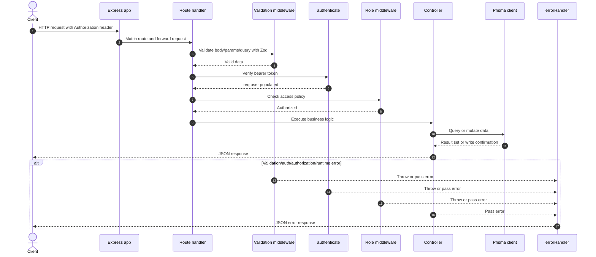

# Architecture Overview

This project follows a layered Express architecture:

- Routes define the HTTP surface and attach validation, authentication, and role checks in the right order.
- Controllers hold the request-specific business logic and shape responses.
- Middleware handles cross-cutting concerns such as JWT authentication, authorization, validation, and error handling.
- Prisma provides the database access layer through a generated client.
- Zod schemas validate incoming request bodies, params, and query strings before controller logic runs.

The result is a structure where each layer has a narrow responsibility and route behavior is easy to trace from URL to controller.

## `src` Folder Tree

```text
src/
├── app.ts
├── controllers/
│   ├── authController.ts
│   ├── commentsController.ts
│   └── postsController.ts
├── db/
│   └── prisma.ts
├── errors/
│   └── HttpError.ts
├── generated/
│   └── prisma/
├── middleware/
│   ├── authenticate.ts
│   ├── checkRoles.ts
│   └── error.ts
├── routes/
│   ├── auth.ts
│   ├── comments.ts
│   ├── nestedComments.ts
│   └── posts.ts
├── types/
│   └── types.ts
└── validation/
	├── authSchemas.ts
	├── commentsSchemas.ts
	├── postsSchemas.ts
	├── utils.ts
	└── validator.ts
```

### Folder Descriptions

- `app.ts` wires the Express app, global middleware, routers, and error handler.
- `controllers/` contains the core operations for authentication, posts, and comments.
- `db/` exposes the Prisma client configuration used throughout the app.
- `errors/` defines application-specific error types such as `HttpError`.
- `generated/prisma/` stores the generated Prisma client output.
- `middleware/` contains authentication, role checks, and centralized error handling.
- `routes/` defines the API endpoints and composes middleware chains.
- `types/` contains shared TypeScript request types.
- `validation/` contains Zod schemas and helpers for request validation.

## Route and Middleware Design

The main entry point is [`src/app.ts`](../src/app.ts), which mounts these route groups:

- `/api/auth` -> [`src/routes/auth.ts`](../src/routes/auth.ts)
- `/api/posts` -> [`src/routes/posts.ts`](../src/routes/posts.ts)
- `/api/comments` -> [`src/routes/comments.ts`](../src/routes/comments.ts)

The route modules compose middleware in a predictable order:

- Validation runs first so bad input is rejected early.
- `authenticate` or `optionalAuthenticate` parses and verifies the JWT when a request needs user context.
- `isAdmin` or `isEditor` enforces role-based access for write operations on posts.
- Controllers execute only after the request has passed the required guards.

Main middleware responsibilities:

- `authenticate.ts` extracts a bearer token, verifies it with `SECRET_KEY`, and attaches `req.user`.
- `checkRoles.ts` blocks requests that do not match the required role.
- `error.ts` converts `HttpError`, `ZodError`, and unexpected failures into JSON responses.

Main route responsibilities:

- `auth.ts` handles registration and login.
- `posts.ts` handles public reads, admin/editor writes, and nested comment routing under `/api/posts/:postId/comments`.
- `comments.ts` handles direct comment reads and updates/deletes.
- `nestedComments.ts` handles comments that belong to a specific post.

## Request Lifecycle

1. The client sends an HTTP request to the Express app.
2. `express.json()` parses the request body when present.
3. The app-level query helper makes `req.query` writable for later validation and mutation.
4. The request enters the matching router under `/api/auth`, `/api/posts`, or `/api/comments`.
5. Route-level Zod validation checks `body`, `params`, or `query` data.
6. If the route is protected, JWT authentication verifies the bearer token and populates `req.user`.
7. If the route requires a specific role, role middleware checks `req.user.role`.
8. The controller runs the business logic and calls Prisma through the database layer.
9. The controller sends a JSON response.
10. If anything fails, the centralized error handler returns a consistent error payload.

## Mermaid Sequence

The sequence below shows a common authorized request flow, such as creating a post or updating a comment.


