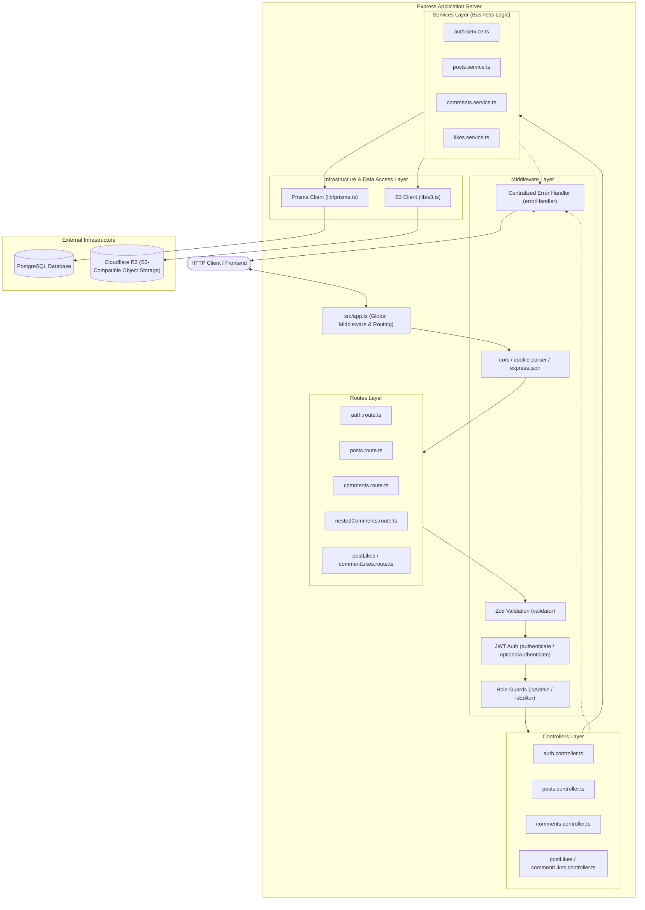
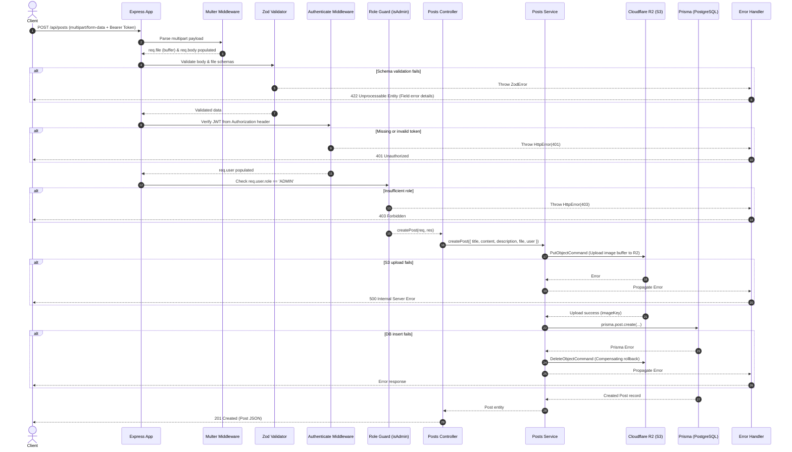

# Architecture Overview

This project implements a layered Express + TypeScript REST API designed for blog content management, comments, user interactions (likes), and media uploads. The architecture follows a strict separation of concerns across distinct layers: **Routing**, **Middleware**, **Controllers**, **Services**, and **Data Access / Infrastructure**.


```mermaid
flowchart TD
    Client(["HTTP Client / Frontend"])

    subgraph AppServer ["Express Application Server"]
        App["src/app.ts (Global Middleware & Routing)"]

        subgraph MiddlewareLayer ["Middleware Layer"]
            Cors["cors / cookie-parser / express.json"]
            Val["Zod Validation (validator)"]
            Auth["JWT Auth (authenticate / optionalAuthenticate)"]
            Roles["Role Guards (isAdmin / isEditor)"]
            Err["Centralized Error Handler (errorHandler)"]
        end

        subgraph RoutesLayer ["Routes Layer"]
            AuthRoute["auth.route.ts"]
            PostsRoute["posts.route.ts"]
            CommentsRoute["comments.route.ts"]
            NestedComments["nestedComments.route.ts"]
            LikesRoutes["postLikes / commentLikes.route.ts"]
        end

        subgraph ControllerLayer ["Controllers Layer"]
            AuthCtrl["auth.controller.ts"]
            PostsCtrl["posts.controller.ts"]
            CommentsCtrl["comments.controller.ts"]
            LikesCtrl["postLikes / commentLikes.controller.ts"]
        end

        subgraph ServiceLayer ["Services Layer (Business Logic)"]
            AuthSvc["auth.service.ts"]
            PostsSvc["posts.service.ts"]
            CommentsSvc["comments.service.ts"]
            LikesSvc["likes.service.ts"]
        end

        subgraph LibLayer ["Infrastructure & Data Access Layer"]
            PrismaClientInstance["Prisma Client (lib/prisma.ts)"]
            S3ClientInstance["S3 Client (lib/s3.ts)"]
        end
    end

    subgraph ExternalServices ["External Infrastructure"]
        PostgreSQL[("PostgreSQL Database")]
        CloudflareR2[("Cloudflare R2 (S3-Compatible Object Storage)")]
    end

    Client <--> App
    App --> Cors --> RoutesLayer
    RoutesLayer --> Val --> Auth --> Roles --> ControllerLayer
    ControllerLayer --> ServiceLayer
    ServiceLayer --> PrismaClientInstance --> PostgreSQL
    ServiceLayer --> S3ClientInstance --> CloudflareR2
    MiddlewareLayer -.-> Err
    ControllerLayer -.-> Err
    ServiceLayer -.-> Err
    Err --> Client
```

---

## Tech Stack

| Domain                 | Technology / Library                                            | Role & Purpose                                                                          |
| ---------------------- | --------------------------------------------------------------- | --------------------------------------------------------------------------------------- |
| **Runtime & Language** | Node.js (ESM), TypeScript                                       | Execution runtime and static type checking                                              |
| **Web Framework**      | Express 5                                                       | HTTP server, middleware chaining, and route handling                                    |
| **Database & ORM**     | PostgreSQL, Prisma ORM (`@prisma/client`, `@prisma/adapter-pg`) | Relational persistence, migrations, and type-safe query building                        |
| **Object Storage**     | Cloudflare R2, AWS SDK v3 (`@aws-sdk/client-s3`)                | S3-compatible cloud object storage for post hero images                                 |
| **File Handling**      | Multer (`multer`)                                               | `multipart/form-data` parsing and in-memory buffer handling                             |
| **Validation**         | Zod                                                             | Runtime schema validation for request params, query, body, and files                    |
| **Auth & Security**    | JWT (`jsonwebtoken`), `bcrypt`, `cookie-parser`, `cors`         | Token-based authentication, password hashing, HttpOnly cookie sessions, and CORS policy |
| **API Documentation**  | OpenAPI 3.0, Swagger UI (`swagger-ui-express`, `yamljs`)        | Interactive API documentation hosted at `/api-docs`                                     |

---

## Directory Structure (`src/`)

```text
.
├── docs/
│   ├── architecture.md
│   └── database.md
├── prisma/
│   ├── migrations/
│   ├── schema.prisma
│   └── seed.ts
├── src/
│   ├── app.ts
│   ├── controllers/
│   │   ├── auth.controller.ts
│   │   ├── commentLikes.controller.ts
│   │   ├── comments.controller.ts
│   │   ├── postLikes.controller.ts
│   │   └── posts.controller.ts
│   ├── errors/
│   │   └── HttpError.ts
│   ├── generated/
│   │   └── prisma/
│   ├── lib/
│   │   ├── prisma.ts
│   │   └── s3.ts
│   ├── middleware/
│   │   ├── authenticate.ts
│   │   ├── checkRoles.ts
│   │   └── error.ts
│   ├── routes/
│   │   ├── auth.route.ts
│   │   ├── commentLikes.route.ts
│   │   ├── comments.route.ts
│   │   ├── nestedComments.route.ts
│   │   ├── postLikes.route.ts
│   │   └── posts.route.ts
│   ├── services/
│   │   ├── auth.service.ts
│   │   ├── comments.service.ts
│   │   ├── likes.service.ts
│   │   ├── media.service.ts
│   │   └── posts.service.ts
│   ├── types/
│   │   ├── auth.types.ts
│   │   ├── express.types.ts
│   │   └── index.ts
│   ├── utils/
│   │   └── cookies.ts
│   └── validation/
│       ├── authSchemas.ts
│       ├── commentsSchemas.ts
│       ├── postsSchemas.ts
│       ├── utils.ts
│       └── validator.ts
├── openapi.yaml
├── package.json
└── README.md
```

### Layer Responsibilities

1. **Entry Point (`src/app.ts`)**:
   - Boots the Express application and attaches core top-level middlewares (`express.json()`, `cors`, `cookieParser()`, custom `req.query` descriptor).
   - Mounts Swagger UI documentation (`/api-docs`).
   - Mounts top-level routers (`/api/auth`, `/api/posts`, `/api/comments`).
   - Registers the global error handler (`errorHandler`) as the final middleware.

2. **Routes Layer (`src/routes/`)**:
   - Defines HTTP endpoints, HTTP verbs, and URL parameter paths.
   - Composes middleware in sequence: file upload -> schema validation -> authentication -> authorization guards -> controller.
   - Handles sub-routing (e.g., nested comments under `/api/posts/:postId/comments` and likes under `/api/posts/:postId/likes`).

3. **Middleware Layer (`src/middleware/`)**:
   - `validator.ts`: Executes Zod schemas on `req.body`, `req.params`, `req.query`, and `req.file`.
   - `authenticate.ts`: Decodes and verifies JWT Bearer tokens from the `Authorization` header and populates `req.user` (`authenticate` for mandatory auth, `optionalAuthenticate` for public endpoints that adapt if a user is logged in).
   - `checkRoles.ts`: Enforces role-based access control (`isAdmin`, `isEditor`).
   - `error.ts`: Centralizes error interception. Maps `HttpError` to corresponding HTTP status codes, formats `ZodError` into structured error lists (HTTP 422), and masks unhandled exceptions (HTTP 500).

4. **Controllers Layer (`src/controllers/`)**:
   - Extracts typed inputs from `req.body`, `req.params`, `req.query`, `req.file`, and `req.user`.
   - Delegates business logic execution directly to the Services layer.
   - Formats and sends HTTP responses (status codes, JSON payloads, pagination metadata).

5. **Services Layer (`src/services/`)**:
   - Houses all core business rules and domain logic.
   - Interacts with Prisma ORM (`prisma`) for database CRUD and transactions.
   - Handles password hashing (`bcrypt`), JWT token generation, and refresh token cookie synchronization (`utils/cookies.ts`).
   - Manages S3 / Cloudflare R2 uploads and cleanup (`PutObjectCommand`, `DeleteObjectCommand`).
   - Throws domain/operational `HttpError` instances when business constraints are violated.

6. **Infrastructure & Shared Utilities (`src/lib/`, `src/utils/`, `src/errors/`, `src/types/`)**:
   - `lib/prisma.ts`: Initializes `PrismaClient` with `@prisma/adapter-pg`.
   - `lib/s3.ts`: Configures `S3Client` pointing to Cloudflare R2 endpoints.
   - `utils/cookies.ts`: Helper functions to set and clear secure `HttpOnly` refresh token cookies.
   - `errors/HttpError.ts`: Custom error class containing HTTP status codes.
   - `types/types.ts`: Express `Request` type extensions (`AuthenticatedRequest`).

---

## Authentication & Session Management

The API implements a dual-token authentication model:

- **Access Token**:
  - Stateless JSON Web Token (JWT) with a short lifespan (15 minutes).
  - Payload contains `id` and `role` (`USER`, `EDITOR`, `ADMIN`).
  - Passed via the HTTP `Authorization: Bearer <token>` header.
- **Refresh Token**:
  - Long-lived token (10 days) stored in the PostgreSQL database (`RefreshToken` table).
  - Delivered and stored in a secure, `HttpOnly`, `SameSite=Lax` cookie.
  - Rotated upon every refresh (`POST /api/auth/refresh`).
  - Deleted from database and cleared from browser cookies upon logout (`POST /api/auth/logout`).

---

## Core Data Models & Relations

Defined in `prisma/schema.prisma`:

| Model              | Purpose                                                                              | Key Relations                                                          |
| ------------------ | ------------------------------------------------------------------------------------ | ---------------------------------------------------------------------- |
| **`User`**         | Stores credentials and authorization roles (`USER`, `EDITOR`, `ADMIN`).              | Has many `Post`, `Comment`, `PostLike`, `CommentLike`, `RefreshToken`. |
| **`Post`**         | Blog posts with visibility state (`DRAFT`, `PUBLISHED`, `HIDDEN`) and R2 `imageKey`. | Belongs to `User`; has many `Comment`, `PostLike`.                     |
| **`Comment`**      | User comments attached to blog posts.                                                | Belongs to `User` and `Post`; has many `CommentLike`.                  |
| **`PostLike`**     | Unique like toggle per `(postId, userId)` pair.                                      | Belongs to `Post` and `User`.                                          |
| **`CommentLike`**  | Unique like toggle per `(commentId, userId)` pair.                                   | Belongs to `Comment` and `User`.                                       |
| **`RefreshToken`** | Stores active refresh tokens for session rotation and revocation.                    | Belongs to `User`.                                                     |

---

## Request Lifecycle & Data Flow

### Sequence Diagram: Authenticated Post Creation with Image Upload


```mermaid
sequenceDiagram
    autonumber
    actor Client
    participant Express as Express App
    participant Multer as Multer Middleware
    participant Val as Zod Validator
    participant Auth as Authenticate Middleware
    participant Role as Role Guard (isAdmin)
    participant Ctrl as Posts Controller
    participant Svc as Posts Service
    participant S3 as Cloudflare R2 (S3)
    participant DB as Prisma (PostgreSQL)
    participant Err as Error Handler

    Client->>Express: POST /api/posts (multipart/form-data + Bearer Token)
    Express->>Multer: Parse multipart payload
    Multer-->>Express: req.file (buffer) & req.body populated
    Express->>Val: Validate body & file schemas
    alt Schema validation fails
        Val-->>Err: Throw ZodError
        Err-->>Client: 422 Unprocessable Entity (Field error details)
    end
    Val-->>Express: Validated data
    Express->>Auth: Verify JWT from Authorization header
    alt Missing or invalid token
        Auth-->>Err: Throw HttpError(401)
        Err-->>Client: 401 Unauthorized
    end
    Auth-->>Express: req.user populated
    Express->>Role: Check req.user.role == 'ADMIN'
    alt Insufficient role
        Role-->>Err: Throw HttpError(403)
        Err-->>Client: 403 Forbidden
    end
    Role-->>Ctrl: createPost(req, res)
    Ctrl->>Svc: createPost({ title, content, description, file, user })
    Svc->>S3: PutObjectCommand (Upload image buffer to R2)
    alt S3 upload fails
        S3-->>Svc: Error
        Svc-->>Err: Propagate Error
        Err-->>Client: 500 Internal Server Error
    end
    S3-->>Svc: Upload success (imageKey)
    Svc->>DB: prisma.post.create(...)
    alt DB insert fails
        DB-->>Svc: Prisma Error
        Svc->>S3: DeleteObjectCommand (Compensating rollback)
        Svc-->>Err: Propagate Error
        Err-->>Client: Error response
    end
    DB-->>Svc: Created Post record
    Svc-->>Ctrl: Post entity
    Ctrl-->>Client: 201 Created (Post JSON)
```
