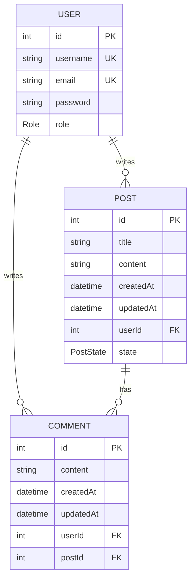

# Database Guide

This project uses PostgreSQL as the database engine and Prisma as the ORM. Prisma defines the data model in `prisma/schema.prisma`, generates a type-safe client into `src/generated/prisma`, and provides migration tooling for evolving the schema over time.

## DBMS and ORM

- DBMS: PostgreSQL
- ORM: Prisma

PostgreSQL stores the application data, while Prisma handles schema definition, query building, and client generation. The schema is organized around three core models: `User`, `Post`, and `Comment`.

## ER Diagram



## Model Details

### User

The `User` model stores account and authorization data.

- `id`: Auto-incrementing primary key.
- `username`: Unique username, limited to 50 characters.
- `email`: Unique email address, limited to 255 characters.
- `password`: Hashed password, limited to 120 characters.
- `role`: User role used for authorization checks. Defaults to `USER`.
- `posts`: One-to-many relation to `Post`.
- `comments`: One-to-many relation to `Comment`.

### Post

The `Post` model stores blog post content and publication state.

- `id`: Auto-incrementing primary key.
- `title`: Post title, limited to 255 characters.
- `content`: Optional body content.
- `createdAt`: Timestamp set when the record is created.
- `updatedAt`: Timestamp updated automatically on every change.
- `userId`: Foreign key to the author in `User`.
- `user`: Relation to the authoring user.
- `comments`: One-to-many relation to `Comment`.
- `state`: Post visibility/state. Defaults to `DRAFT`.

### Comment

The `Comment` model stores comments attached to posts.

- `id`: Auto-incrementing primary key.
- `content`: Comment text, limited to 400 characters.
- `createdAt`: Timestamp set when the record is created.
- `updatedAt`: Timestamp updated automatically on every change.
- `userId`: Foreign key to the author in `User`.
- `user`: Relation to the commenting user.
- `postId`: Foreign key to the parent post in `Post`.
- `post`: Relation to the parent post.

## Enums

### Role

Used for access control across the API.

- `USER`
- `EDITOR`
- `ADMIN`

### PostState

Used to describe the current state of a post.

- `DRAFT`
- `PUBLISHED`
- `HIDDEN`

## Migrations and Prisma Client

To apply schema changes to the database and generate the client, run:

```bash
npx prisma migrate dev
```

That command creates a migration from the current schema, applies it to the database, and regenerates the Prisma client when needed.

If you only need to regenerate the client after a schema update, run:

```bash
npx prisma generate
```

If you want to re-run the seed script after migrations, use Prisma's seed runner:

```bash
npx prisma db seed
```
