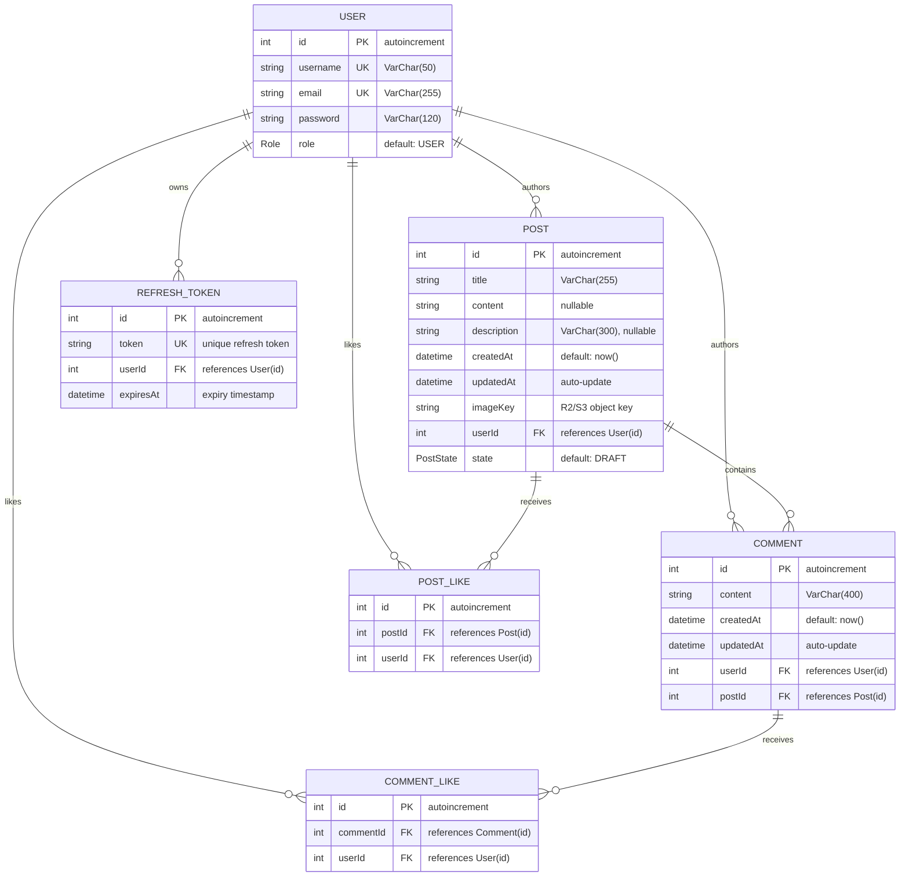

# Database Guide

This project uses **PostgreSQL** as the relational database engine and **Prisma ORM** for schema definition, type-safe migrations, client generation, and data access. The Prisma client is generated into `src/generated/prisma` and utilizes the `@prisma/adapter-pg` driver adapter with connection pooling.

---

## DBMS and ORM Architecture

- **DBMS**: PostgreSQL
- **ORM**: Prisma ORM (`@prisma/client`, `@prisma/adapter-pg`, `pg`)
- **Schema Definition**: `prisma/schema.prisma`
- **Generated Client Output**: `src/generated/prisma`
- **Migration History**: `prisma/migrations/`

---

## Entity-Relationship Diagram (ERD)


```mermaid
erDiagram
    USER ||--o{ POST : "authors"
    USER ||--o{ COMMENT : "authors"
    USER ||--o{ REFRESH_TOKEN : "owns"
    USER ||--o{ POST_LIKE : "likes"
    USER ||--o{ COMMENT_LIKE : "likes"

    POST ||--o{ COMMENT : "contains"
    POST ||--o{ POST_LIKE : "receives"

    COMMENT ||--o{ COMMENT_LIKE : "receives"

    USER {
        int id PK "autoincrement"
        string username UK "VarChar(50)"
        string email UK "VarChar(255)"
        string password "VarChar(120)"
        Role role "default: USER"
    }

    POST {
        int id PK "autoincrement"
        string title "VarChar(255)"
        string content "nullable"
        string description "VarChar(300), nullable"
        datetime createdAt "default: now()"
        datetime updatedAt "auto-update"
        string imageKey "R2/S3 object key"
        int userId FK "references User(id)"
        PostState state "default: DRAFT"
    }

    COMMENT {
        int id PK "autoincrement"
        string content "VarChar(400)"
        datetime createdAt "default: now()"
        datetime updatedAt "auto-update"
        int userId FK "references User(id)"
        int postId FK "references Post(id)"
    }

    POST_LIKE {
        int id PK "autoincrement"
        int postId FK "references Post(id)"
        int userId FK "references User(id)"
    }

    COMMENT_LIKE {
        int id PK "autoincrement"
        int commentId FK "references Comment(id)"
        int userId FK "references User(id)"
    }

    REFRESH_TOKEN {
        int id PK "autoincrement"
        string token UK "unique refresh token"
        int userId FK "references User(id)"
        datetime expiresAt "expiry timestamp"
    }
```

---

## Model Breakdowns

### 1. `User` Model

Stores user credentials, profile information, and authorization roles.

| Column | Prisma Type | DB Type | Nullable | Default | Constraints | Description |
| --- | --- | --- | --- | --- | --- | --- |
| `id` | `Int` | `SERIAL` | No | `autoincrement()` | `PRIMARY KEY` | Unique surrogate identifier |
| `username` | `String` | `VARCHAR(50)` | No | — | `UNIQUE` | Unique username for login and identification |
| `email` | `String` | `VARCHAR(255)` | No | — | `UNIQUE` | Unique user email address |
| `password` | `String` | `VARCHAR(120)` | No | — | — | Hashed password string (bcrypt) |
| `role` | `Role` | `ENUM` | No | `'USER'` | — | Authorization role (`USER`, `EDITOR`, `ADMIN`) |

**Relations:**
- `posts`: 1-to-many relation with `Post` (`onDelete: Cascade`).
- `comments`: 1-to-many relation with `Comment` (`onDelete: Cascade`).
- `refreshTokens`: 1-to-many relation with `RefreshToken` (`onDelete: Cascade`).
- `postLikes`: 1-to-many relation with `PostLike` (`onDelete: Cascade`).
- `commentLikes`: 1-to-many relation with `CommentLike` (`onDelete: Cascade`).

---

### 2. `Post` Model

Represents blog articles and publication states with Cloudflare R2 / S3 image associations.

| Column | Prisma Type | DB Type | Nullable | Default | Constraints | Description |
| --- | --- | --- | --- | --- | --- | --- |
| `id` | `Int` | `SERIAL` | No | `autoincrement()` | `PRIMARY KEY` | Unique surrogate identifier |
| `title` | `String` | `VARCHAR(255)` | No | — | — | Blog post headline / title |
| `content` | `String?` | `TEXT` | **Yes** | `null` | — | Main post body in Markdown format |
| `description` | `String?` | `VARCHAR(300)` | **Yes** | `null` | — | Short excerpt / summary |
| `createdAt` | `DateTime` | `TIMESTAMP(3)` | No | `now()` | — | Record creation timestamp |
| `updatedAt` | `DateTime` | `TIMESTAMP(3)` | No | `@updatedAt` | — | Record last update timestamp |
| `imageKey` | `String` | `TEXT` | No | — | — | Cloudflare R2 / S3 object key for the post cover image |
| `userId` | `Int` | `INTEGER` | No | — | `FOREIGN KEY` | References `User(id)` on delete cascade |
| `state` | `PostState` | `ENUM` | No | `'DRAFT'` | — | Publication status (`DRAFT`, `PUBLISHED`, `HIDDEN`) |

**Relations:**
- `user`: Belongs to `User` via `userId`.
- `comments`: 1-to-many relation with `Comment` (`onDelete: Cascade`).
- `likes`: 1-to-many relation with `PostLike` (`onDelete: Cascade`).

---

### 3. `Comment` Model

Represents user comments attached to specific blog posts.

| Column | Prisma Type | DB Type | Nullable | Default | Constraints | Description |
| --- | --- | --- | --- | --- | --- | --- |
| `id` | `Int` | `SERIAL` | No | `autoincrement()` | `PRIMARY KEY` | Unique surrogate identifier |
| `content` | `String` | `VARCHAR(400)` | No | — | — | Comment text body |
| `createdAt` | `DateTime` | `TIMESTAMP(3)` | No | `now()` | — | Comment creation timestamp |
| `updatedAt` | `DateTime` | `TIMESTAMP(3)` | No | `@updatedAt` | — | Comment last update timestamp |
| `userId` | `Int` | `INTEGER` | No | — | `FOREIGN KEY` | References `User(id)` on delete cascade |
| `postId` | `Int` | `INTEGER` | No | — | `FOREIGN KEY` | References `Post(id)` on delete cascade |

**Relations:**
- `user`: Belongs to `User` via `userId`.
- `post`: Belongs to `Post` via `postId`.
- `likes`: 1-to-many relation with `CommentLike` (`onDelete: Cascade`).

---

### 4. `PostLike` Model

Join table tracking user likes on blog posts.

| Column | Prisma Type | DB Type | Nullable | Default | Constraints | Description |
| --- | --- | --- | --- | --- | --- | --- |
| `id` | `Int` | `SERIAL` | No | `autoincrement()` | `PRIMARY KEY` | Unique surrogate identifier |
| `postId` | `Int` | `INTEGER` | No | — | `FOREIGN KEY` | References `Post(id)` on delete cascade |
| `userId` | `Int` | `INTEGER` | No | — | `FOREIGN KEY` | References `User(id)` on delete cascade |

**Constraints & Indexes:**
- Composite unique constraint: `@@unique([postId, userId])` prevents duplicate likes by the same user on a post.

**Relations:**
- `post`: Belongs to `Post` via `postId`.
- `user`: Belongs to `User` via `userId`.

---

### 5. `CommentLike` Model

Join table tracking user likes on comments.

| Column | Prisma Type | DB Type | Nullable | Default | Constraints | Description |
| --- | --- | --- | --- | --- | --- | --- |
| `id` | `Int` | `SERIAL` | No | `autoincrement()` | `PRIMARY KEY` | Unique surrogate identifier |
| `commentId` | `Int` | `INTEGER` | No | — | `FOREIGN KEY` | References `Comment(id)` on delete cascade |
| `userId` | `Int` | `INTEGER` | No | — | `FOREIGN KEY` | References `User(id)` on delete cascade |

**Constraints & Indexes:**
- Composite unique constraint: `@@unique([commentId, userId])` prevents duplicate likes by the same user on a comment.

**Relations:**
- `comment`: Belongs to `Comment` via `commentId`.
- `user`: Belongs to `User` via `userId`.

---

### 6. `RefreshToken` Model

Stores active refresh tokens for session rotation and user logout invalidation.

| Column | Prisma Type | DB Type | Nullable | Default | Constraints | Description |
| --- | --- | --- | --- | --- | --- | --- |
| `id` | `Int` | `SERIAL` | No | `autoincrement()` | `PRIMARY KEY` | Unique surrogate identifier |
| `token` | `String` | `TEXT` | No | — | `UNIQUE` | Cryptographic JWT refresh token string |
| `userId` | `Int` | `INTEGER` | No | — | `FOREIGN KEY` | References `User(id)` on delete cascade |
| `expiresAt` | `DateTime` | `TIMESTAMP(3)` | No | — | — | Token expiration datetime |

**Relations:**
- `user`: Belongs to `User` via `userId`.

---

## Enums

### `Role`

Used for role-based authorization across API endpoints.

| Value | Access Level | Description |
| --- | --- | --- |
| `USER` | Standard User | Default role. Can read published content, post comments, update/delete own comments, and toggle likes. |
| `EDITOR` | Content Editor | Can create and edit blog posts, update own content, and manage comments. |
| `ADMIN` | System Administrator | Full access. Can create, edit, delete, and manage visibility of any post, delete any comment, and manage all users. |

### `PostState`

Defines the lifecycle and visibility state of blog posts.

| Value | Visibility | Description |
| --- | --- | --- |
| `DRAFT` | Private (Admin only) | Default state. Draft post under creation or review. Content and description may be empty. |
| `PUBLISHED` | Public | Live post visible to all users and public endpoints. Requires `content` and `description`. |
| `HIDDEN` | Restricted (Admin only) | Hidden / archived post. Excluded from public listing queries. |

---

## Referential Integrity & Cascade Deletions

All foreign key relationships in the schema enforce `onDelete: Cascade`:

1. **User Deletion**:
   - Deleting a `User` automatically removes all associated `Post` records, `Comment` records, `RefreshToken` entries, `PostLike` entries, and `CommentLike` entries.
2. **Post Deletion**:
   - Deleting a `Post` automatically deletes all associated `Comment` records and `PostLike` entries.
   - Deleting a `Post`'s comments further cascades to remove all associated `CommentLike` entries.
3. **Comment Deletion**:
   - Deleting a `Comment` automatically removes all corresponding `CommentLike` entries.

---

## Indexes & Performance Considerations

1. **Primary Key Indexes (B-Tree)**:
   - Implicit clustered B-tree index on `id` across all 6 tables (`User`, `Post`, `Comment`, `PostLike`, `CommentLike`, `RefreshToken`).

2. **Unique Indexes**:
   - `User_username_key` on `User(username)`: Accelerates login credential lookups.
   - `User_email_key` on `User(email)`: Accelerates email duplication checks on registration.
   - `RefreshToken_token_key` on `RefreshToken(token)`: Speeds up refresh token verification and session lookup.
   - `PostLike_postId_userId_key` on `PostLike(postId, userId)`: Guarantees unique like per post and accelerates `hasUserLikedPost` queries.
   - `CommentLike_commentId_userId_key` on `CommentLike(commentId, userId)`: Guarantees unique like per comment and accelerates `hasUserLikedComment` queries.

3. **Query Optimization & Transactions**:
   - **Pagination & Ordering**: Post and comment list queries sort by `createdAt DESC` with `take` (limit) and `skip` (offset).
   - **Counting & Aggregations**: Post and comment queries fetch like counts using Prisma's `_count` aggregation within transactional batches (`prisma.$transaction`).
   - **Text Search**: Search filtering uses case-insensitive substring matching (`mode: 'insensitive'`) across `title`, `content`, and `description`.

---

## Migrations and Prisma Tooling

### Apply Migrations

To apply schema changes to the database and generate an updated Prisma client:

```bash
npx prisma migrate dev
```

### Regenerate Client

To regenerate the TypeScript Prisma client manually without running migrations:

```bash
npx prisma generate
```

### Execute Database Seed

To populate the database with seed data:

```bash
npx prisma db seed
```

### Prisma Studio

To inspect and manage records visually in a web UI:

```bash
npx prisma studio
```

